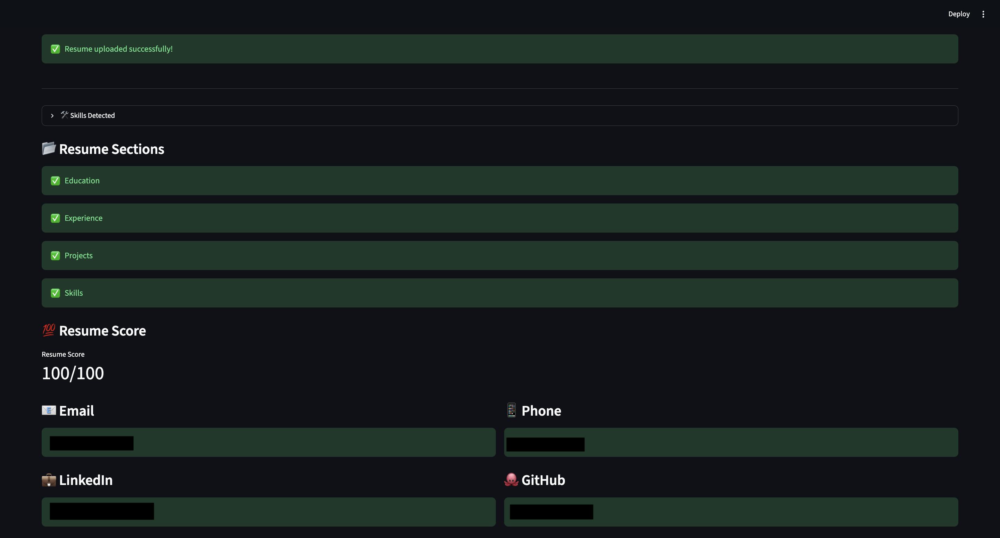
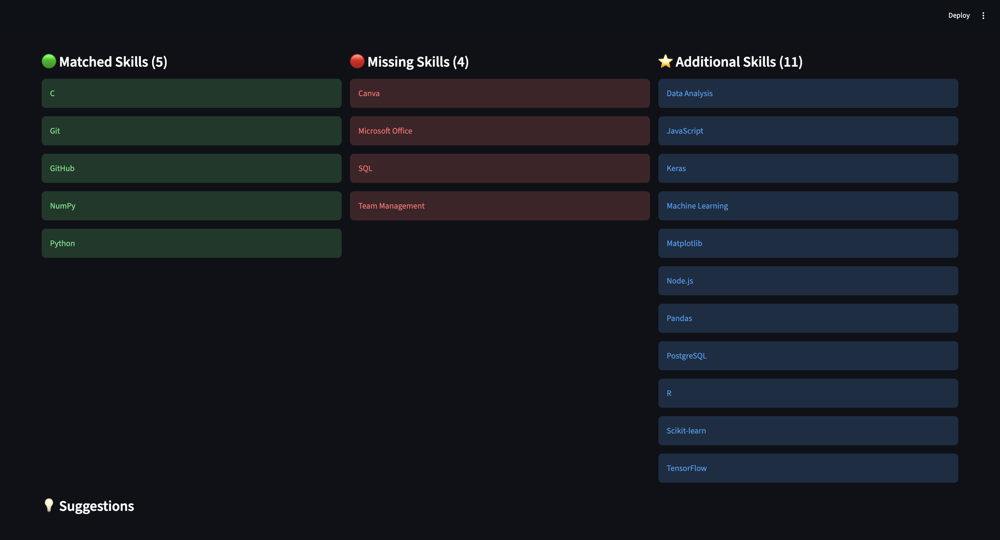
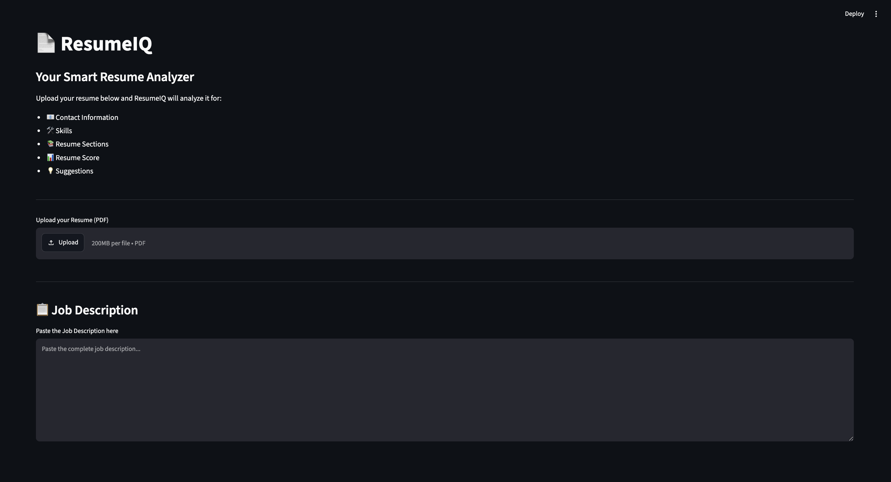

# 📄 ResumeIQ

> **Analyze • Score • Match** — A modern ATS-inspired Resume Analyzer built with **Python** and **Streamlit** that evaluates resumes, extracts important information, calculates a resume score, and compares resumes against job descriptions.


---

# 💡 Motivation

During my time as a **Placement Coordinator** at my college, I was introduced to the process of **CV vetting** while reviewing student resumes. I realized that manually checking resumes for essential information, skills, and overall quality was repetitive and time-consuming.

This inspired me to build **ResumeIQ**—a tool that automates resume analysis by evaluating key sections, extracting important information, calculating an ATS-inspired score, and comparing resumes against job descriptions.

The project also allowed me to apply concepts such as **text processing, regular expressions, modular programming, and interactive dashboards** to solve a practical, real-world problem.

---

# 📸 Project Preview

## Dashboard



---

# ✨ Features

## 📄 Resume Analysis

- Upload PDF resumes
- Extract resume text
- Detect resume sections
- Resume quality score
- Personalized improvement suggestions

---

## 📞 Contact Detection

- 📧 Email Detection
- 📱 Phone Number Detection
- 💼 LinkedIn Profile Detection
- 🐙 GitHub Profile Detection
- 🔗 Hyperlink Detection

---

## 🛠 Skills Analysis

- Technical Skill Detection
- Soft Skill Detection
- Large predefined skill database
- Resume skill extraction

---

## 🎯 ATS Job Matching

- Paste any Job Description
- ATS Match Score
- Matched Skills
- Missing Skills
- Additional Resume Skills

---

## 🎨 Modern Dashboard

- Clean Dark Theme
- Resume Overview
- Progress Indicators
- Organized Dashboard Layout

---

# 🛠 Tech Stack

- Python
- Streamlit
- pdfplumber
- Regular Expressions (Regex)
- Set Operations
- Modular Python Architecture

---

# 📂 Project Structure

```text
ResumeIQ/
│
├── images/
│   ├── dashboard.png
│   ├── ats-match.png
│   └── suggestions.png
│
├── sample_resumes/
│
├── utils/
│   ├── contact_detector.py
│   ├── job_matcher.py
│   ├── pdf_reader.py
│   ├── scorer.py
│   ├── section_detector.py
│   ├── skill_detector.py
│   └── suggestions.py
│
├── app.py
├── requirements.txt
├── LICENSE
└── README.md
```

---

# 🚀 Installation

Clone the repository

```bash
git clone https://github.com/ekanshchaudhari/ResumeIQ.git
```

Move into the project folder

```bash
cd ResumeIQ
```

Install dependencies

```bash
pip install -r requirements.txt
```

Run the application

```bash
streamlit run app.py
```

---

# 🌐 Live Demo

The application currently runs locally using **Streamlit**.

To launch it:

```bash
streamlit run app.py
```

> A cloud deployment may be added in a future release.

---

# ⚙️ How It Works

1. Upload a resume in PDF format.
2. ResumeIQ extracts text and embedded hyperlinks.
3. Contact information is detected using Regular Expressions.
4. Skills are identified using a predefined skills database.
5. Resume sections are analyzed.
6. A Resume Score is calculated.
7. Paste a Job Description.
8. ResumeIQ compares the required skills with the resume.
9. Displays:
   - Resume Score
   - ATS Match Score
   - Matched Skills
   - Missing Skills
   - Additional Resume Skills
   - Resume Improvement Suggestions

---

# 📸 More Screenshots

## ATS Match



---

## Resume Suggestions



---

# 🎯 Key Highlights

- 📄 Modular Python Codebase
- 🎯 Rule-based ATS Matching
- 📊 Resume Scoring System
- 🔗 Hyperlink Extraction from PDFs
- 🛠 Skill Detection Engine
- 📂 Resume Section Analysis
- 🎨 Clean Dashboard UI

---

# 🔮 Future Improvements

- Support DOCX resumes
- Export analysis report as PDF
- Enhanced ATS scoring algorithm
- Resume health dashboard
- Better keyword ranking
- Improved UI components
- Cloud deployment using Streamlit Community Cloud

---

# 🙏 Acknowledgements

This project was inspired by my experience as a **Placement Coordinator**, where I was introduced to the process of **CV vetting**. ResumeIQ was built to simplify and automate parts of that workflow while providing students with actionable feedback on their resumes.

---

# 👨‍💻 Author

**Ekansh Chaudhari**

- GitHub: https://github.com/ekanshchaudhari
- LinkedIn: https://www.linkedin.com/in/ekansh-chaudhari-872914190/

---

# ⭐ Support

If you found this project useful, consider giving it a **⭐ Star** on GitHub.

It helps others discover the project and motivates future improvements.

---

### 📌 Version

**ResumeIQ v1.0**

*A resume analysis and ATS-inspired matching tool built using Python and Streamlit.*
